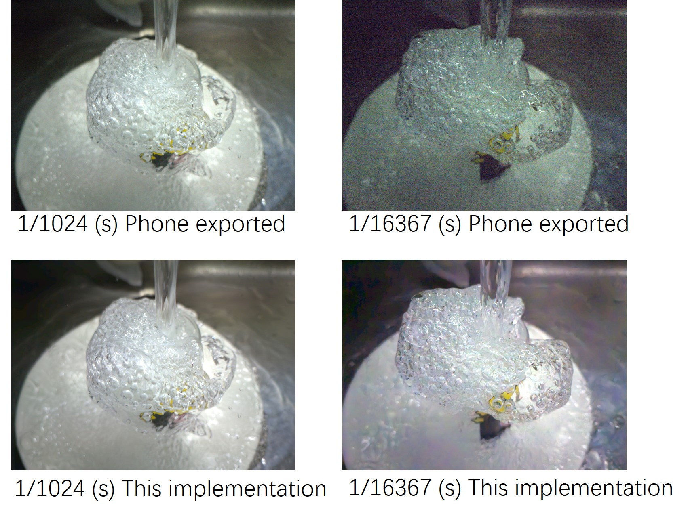

# Android High Speed Camera (AHSC)

## Introduction
AHSC is an implementation deployed on Android devices to perform denoising on photos taken at high shutter speeds. (This Android implementation is modified for https://github.com/googlearchive/android-Camera2Raw)

Current image denoising applications generally perform denoising for pictures taken in low light environments or pictures taken using high ISO. For general shooting scenarios, lowering the ISO and extending the exposure can result in clearer images. However, for some scenarios where a high-speed shutter is required, such as the above image of water flow, underexposed images are also obtained.

And there is a lack of datasets for studying underexposed images with high-speed shutters. I have implemented an [Android application](https://github.com/WeihaoZhuang/RawCollection) that can shoot multiple frames, multiple ISOs, multiple shutter speeds and pixel alignment for researchers to collect data.

## Models & Training Methods & Related Papers
This implementation uses [PMRID [1]](https://github.com/MegEngine/PMRID) as the denoising model and is coupled with the training method of [RNS [2]](https://github.com/zhangyi-3/noise-synthesis) to optimize the denoising model. This implementation is an extension of our [proposed study [3]](https://arxiv.org/abs/2211.16034) on denoising for images taken by high-speed cameras.

[1] Wang, Yuzhi, et al. "Practical deep raw image denoising on mobile devices." European Conference on Computer Vision. Springer, Cham, 2020.

[2] Zhang, Yi, et al. "Rethinking noise synthesis and modeling in raw denoising." Proceedings of the IEEE/CVF International Conference on Computer Vision. 2021.

[3] Zhuang, Weihao, et al. "Learn to See Faster: Pushing the Limits of High-Speed Camera with Deep Underexposed Image Denoising." arXiv preprint arXiv:2211.16034 (2022).

## APP APK
[Google Drive](https://drive.google.com/drive/folders/15NY09Mk1J_RMB7givdyGb7aSaGpH98yF?usp=share_link)

[Baidu Wangpan](https://pan.baidu.com/s/1unLRGbsC3HbTki-ikgBSAg) (password: xve9)

